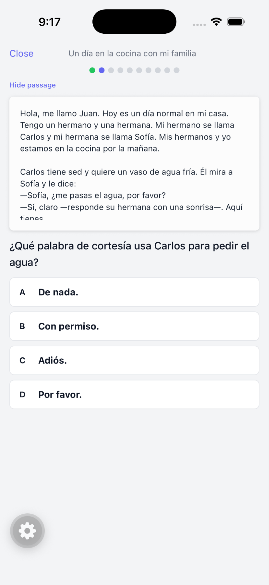
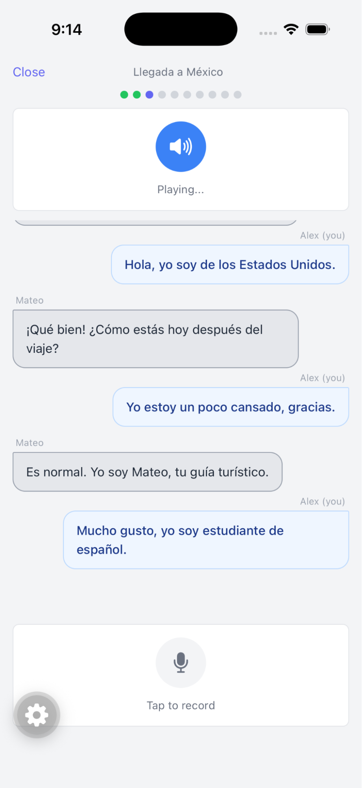
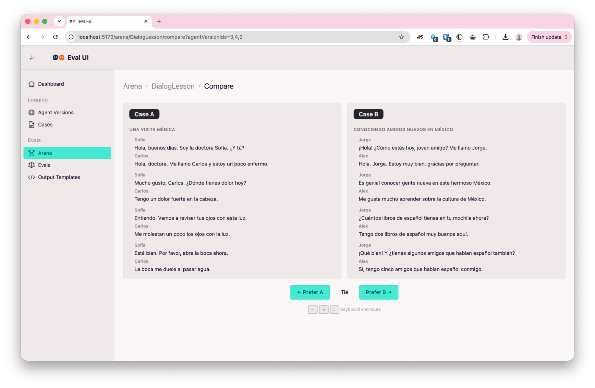

You’ve built some AI Agents. They are doing their job. Could they be doing it better? Could they be doing it cheaper? You have assumptions about those questions, but it’s hard to know for sure. The industry standard solution is Evals. Evals come in many forms, but they all measure how well your agents perform. They can be human-provided or use an LLM-as-a-Judge. They can be a binary selection (good/bad, helpful/unhelpful, etc) or a rating. 

There are many tools for building agent evals. Popular open source options include [LangFuse](https://langfuse.com/), [DeepEval](https://deepeval.com/), and [PromptFoo](https://www.promptfoo.dev/). Commercial offerings are just as varied, each with their own opinion on what is important and how you should build and run your evals.

In my review of the space, I’ve found that most of these tools focus on evaluating one agent output at a time–or “pointwise” evals. This makes sense; you can run pointwise evals “online”–checking each output as it is generated. Online pointwise evals solve the dual problems of understanding how your system is performing and responding appropriately if an agent’s output is below a certain quality threshold.

### Pointwise evals

Pointwise evals are useful, but come with challenges. If the eval is a binary selection, there’s no signal once the output consistently crosses a “good enough” threshold. If the eval is instead a rating out of 10, it becomes more useful, but takes a lot more work to calibrate. What is a 10? What are the subtle nuances between a 6 and a 7? If you split up the work between multiple raters, how do you make sure that they’re all using the same scale? Validating your eval is a small ML project in itself. It’s turtles all the way down.

The research backs this up. “Our experimental results show that judge models inherently exhibit biases in their scoring tendencies” ([Evaluating Scoring Bias in LLM-as-a-Judge (2026)](https://doi.org/10.48550/arXiv.2506.22316)). I’ve seen that show up as an LLM-as-a-judge that consistently scored every output as a 4 out of 5\. Not the best use of a token budget.

So binary selections are easy but limited, and ratings are nuanced but difficult to get right. This essay will explore the idea of “pairwise” evals and how I used them to refine one of my own agents–achieving a 95% cost savings and cutting execution time by 75%.

### Pairwise evals

Pairwise evals leverage the relative ease of comparing things to build a robust ranking of agent variations. Pairwise evaluation is easier for humans ([The method of Adaptive Comparative Judgement, 2011](https://doi.org/10.1080/0969594X.2012.665354)) and more reliable for LLMs ([Aligning with Human Judgement: The Role of Pairwise Preference in Large Language Model Evaluators, 2024](https://doi.org/10.48550/arXiv.2403.16950)).

Going from pairwise comparisons to scored rankings is an active field of study with a long history. The most well known model is the Elo rating system. Elo ratings are used in chess to score the relative strength of chess players–all serious chess players know their Elo rating. One feature of Elo ratings is that they prioritize the most recently added outcomes. This is nice in chess, where there’s an assumption that player skill changes over time, but an active downside in our context. Agent “skill” should be consistent if all parameters are held constant.

For my purposes, I like the Bradley-Terry model. This is the same model that [Chatbot Arena uses for statistical inference on model strength](https://arena.ai/blog/extended-arena/). It evenly weights every outcome in the dataset to calculate a rating. Even weighting comes at a cost: adding a single record requires recalculating with the entire dataset. This can get slow at scale, but for the data I’m working with it’s not a problem.

### Language App and Eval UI

I’ve been working on a language app to help me learn Spanish. I have agents that generate lessons to help me practice concepts–read a paragraph and answer some questions, participate in a dialog, etc. I don’t have an unlimited budget, so I want to make sure I make the best use of every penny I spend on LLM tokens.

  
  

Because the field of open source tooling is dominated by pointwise evaluators, I’ve also built myself a tool for pairwise agent evaluation. It surfaces two agent outputs side-by-side, where I am prompted with “Prefer A”, “Prefer B”, or “Tie”.

### The baseline

To establish a baseline, I generated 10 example lessons using each of `gemini-3.1-flash-lite` (Flash Lite), `gemini-3.5-flash` (Flash), and `claude-sonnet-4-5-20250929` (Sonnet) for a single lesson type. Then, I used the Eval UI to evaluate a small sample of lesson output pairs. The app uses the [Newman](https://doi.org/10.48550/arXiv.2207.00076) form of the Bradley-Terry model to quickly calculate rankings while accommodating ties. It turns these pairwise evals into a leaderboard of different “agent versions”. Agent versions are a unique hash of a model, prompt, and output schema. In this first run, Flash won, but it was easily the slowest and most expensive of the three models.

| Version | Model | Score | Wins | Losses | Ties | Avg Cost | Avg Duration |
| :---- | :---- | :---- | :---- | :---- | :---- | :---- | :---- |
| 8942061bfb98 | gemini-3.5-flash | 4.646 | 19 | 1 | 17 | $0.04238 | 20.2s |
| ee6f1da7ddaf | claude-sonnet | 0.527 | 6 | 16 | 17 | $0.02047 | 13.7s |
| d30ea48ff564 | gemini-3.1-flash-lite | 0.375 | 4 | 12 | 12 | $0.00232 | 4.6s |
{caption="This table shows the results of my first run of evals and their rankings. Each row is a single agent version. The scores are the results of the Newman algorithm implemented by [evalica](https://evalica.readthedocs.io/)."}

### Iterating and Recalculating

While comparing outputs, I noticed several common failure modes: the theme of the lesson would be in English, the theme would mention “this is a Spanish learning lesson”, or the conversation would end abruptly instead of coming to a natural conclusion. The two theme-related issues were an excellent reminder that even in systems watched by an LLM-as-a-Judge, there is no substitute for human review. Nothing in my original prompt specified or implied that an English theme was invalid. No AI would have flagged them as a mistake.

<pre><code>RULES:
...
- The 10 exchanges should read as a natural conversation arc (greeting → topic → details → closing), not 10 unrelated snippets
- Only use basic Latin characters, Spanish accented characters (á, é, í, ó, ú, ñ, ü), and ¿¡
<strong>+- The theme and conversation should be entirely in Spanish. Don't include any English.</strong>
<strong>+- Don't reference CEFR levels, or Spanish lessons. This is a normal conversation between two people.</strong>
</code></pre>

To resolve those issues, I added a few rules to my lesson generation prompt. I generated 10 new lessons using Sonnet and Flash Lite and ran through another round of evals comparing them against each other and the previous winner, Flash. The theme-related issues were not present in the new sample.

Looking at the results, Sonnet is the new leader, but Flash Lite also performs as well as or better than the original untuned Flash. This is important because Flash Lite completes the task at 5% of the token cost and four times faster than Flash. Sonnet scored higher because it generated more interesting lessons with varied sentence structure, but Flash Lite was good enough and the cost difference made it a no-brainer.

| Version | Model | Score | Wins | Losses | Ties | Avg Cost | Avg Duration |
| :---- | :---- | :---- | :---- | :---- | :---- | :---- | :---- |
| 5d23d556209a | claude-sonnet | 5.561 | 5 | 3 | 13 | $0.02060 | 13.8s |
| 21f0a6d66c05 | gemini-3.1-flash-lite | 3.805 | 6 | 5 | 17 | $0.00262 | 5.1s |
| 8942061bfb98 | gemini-3.5-flash | 2.534 | 20 | 3 | 31 | $0.04238 | 20.2s |
| ee6f1da7ddaf | claude-sonnet | 0.185 | 6 | 16 | 17 | $0.02047 | 13.7s |
| d30ea48ff564 | gemini-3.1-flash-lite | 0.110 | 4 | 14 | 12 | $0.00232 | 4.6s |
{caption="The updated rankings after I ran through the eval cycle again with the new prompt. Note that I didn’t need to generate new lessons with Flash since it didn’t share the failure case addressed by the new rules and the new prompt rules wouldn’t bring down the cost or duration. I also didn’t need to compare anything to the old agent versions of Sonnet or Flash Lite, since Bradley-Terry handles the transitive nature of A > B > C without A and C ever needing to compete."}

### Results

This is a toy example, but I got useful signal with very few samples and a little evaluation work (50 generated lessons, \<100 total comparisons). Further, nothing about this process is limited to my problem. Pairwise evals will work for any problem where you have comparable outputs. If I need to, this is the first step in creating a “golden dataset” that I can use to set up an LLM-as-a-Judge.

If you’re working with custom agents and have opinions about pairwise vs. pointwise evaluations, I’d love to hear from you\! What have you tried? What’s working well? Hit me up at [erik.wiffin@gmail.com](mailto:erik.wiffin@gmail.com) or book some time on my [calendar](https://calendar.app.google/W3XMUemwBS4nynMW8).

